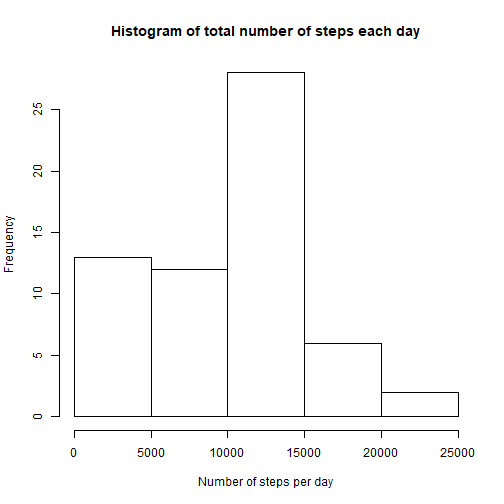
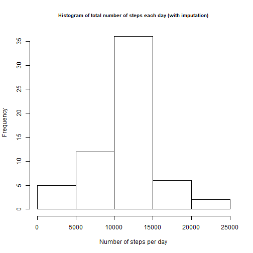
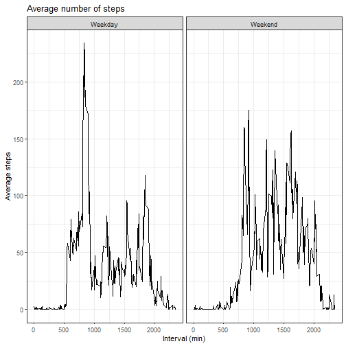

## Assignment 1: Activity Monitoring

It is now possible to collect a large amount of data about personal movement using activity monitoring devices such as a Fitbit, Nike Fuelband, or Jawbone Up. In this assignment, we make use of raw data from such devices.

# Download and read activity data

The data consists of two months of data from an anonymous individual collected during the months of October and November, 2012 and include the number of steps taken in 5 minute intervals each day. The downloaded data was unzipped and the table was read as a csv file and named df.


```r
setwd("~/datasciencecoursera")
unzip("C:/Users/xuesu/Downloads/activity.zip",exdir="./activity")
df<-read.csv("./activity/activity.csv")
```

# 1. Statistics by date
In order to perform statistics on the number of steps by day, the Dplyr package was used. Missing values were removed from this analysis. A histogram was plotted representing the total number of steps per day, followed by calculations on the mean and median number of steps for each day.


```r
# Use dplyr to group data by date
library(dplyr)
df1 <- df %>% group_by(date) %>% summarise(sum=sum(steps,na.rm=TRUE))
```

```
## `summarise()` ungrouping output (override with `.groups` argument)
```

```r
# Histogram
hist(df1$sum,main="Histogram of total number of steps each day",xlab="Number of steps per day")
```



```r
# Reporting mean and median
mean <- mean(df1$sum,na.rm=TRUE)
median <- median(df1$sum,na.rm=TRUE)
paste("Mean =",mean)
```

```
## [1] "Mean = 9354.22950819672"
```

```r
paste("Median =",median)
```

```
## [1] "Median = 10395"
```

# 2. Statistics by interval
The data was also analysed based on the time intervals of the activities. The table was first grouped by the time intervals to calculate the average number of steps. The time interval that showed the maximum average number of steps was calculated using the which.max function.


```r
# Create a new data frame showing the average number of steps for each time interval
byinterval <- group_by(df,interval)
average_by_interval <- summarise(byinterval,mean(steps,na.rm=TRUE))
```

```
## `summarise()` ungrouping output (override with `.groups` argument)
```

```r
names(average_by_interval) <- c("interval","average")

# Create a plot
with(average_by_interval,plot(interval,average,type="l",xlab="Interval (min)",ylab="Average number of steps",main="Time series of activitity"))
```


```r
# Determine the time interval showing the maximum number of steps
maxinterval <- average_by_interval$interval[[which.max(average_by_interval$average)]]
paste("The time interval showing the maximum number of steps is",maxinterval,"minutes")
```

```
## [1] "The time interval showing the maximum number of steps is 835 minutes"
```


# 3. Imputing missing data
The data contained missing values. The presence of missing days may introduce bias into some calculations or summaries of the data. Therefore, we wanted to gain insight into how many missing values there are and to impute them for a better analysis. Here the NAs were replaced by the average number of steps of the corresponding time interval.


```r
# Count NAs
number_of_missing_values <- sum(is.na(df$steps))
paste("There are",number_of_missing_values,"missing values")
```

```
## [1] "There are 2304 missing values"
```

```r
#Imputation
df_impute <- df
for (i in 1:nrow(df)) {
        df_impute
  if (is.na(df$steps[i])){
    df_impute$steps[i] <- average_by_interval$average[average_by_interval$interval==df_impute$interval[i]]
  }
}

df_impute1<-group_by(df_impute,date)

# Histogram
df_impute_summary <- summarise(df_impute1,sum(steps))
```

```
## `summarise()` ungrouping output (override with `.groups` argument)
```

```r
hist(df_impute_summary$`sum(steps)`,main="Histogram of total number of steps each day (with imputation)",xlab="Number of steps per day",cex.main=0.8)
```



```r
# Stats
paste("Mean steps after imputation is",mean(df_impute_summary$`sum(steps)`))
```

```
## [1] "Mean steps after imputation is 10766.1886792453"
```

```r
paste("Median steps after imputation is",median(df_impute_summary$`sum(steps)`))
```

```
## [1] "Median steps after imputation is 10766.1886792453"
```

# 4. Weekdays and weekends

```r
# Create a new data frame to add date information
df2<- df
df2$date<-as.Date(as.character(df2$date),"%Y-%m-%d")
df2$Day<-weekdays(df2$date)

# Divide days into weekdays and weekends
labeling<-data.frame(Day=c("Monday","Tuesday","Wednesday","Thursday","Friday","Saturday","Sunday"),Weekday=c("Weekday","Weekday","Weekday","Weekday","Weekday","Weekend","Weekend"))
df3<- merge(df2,labeling, by="Day")

# Calculate mean number of steps for each time interval for Weekday or Weekends
df4 <- df3%>%group_by(Weekday,interval)%>%summarise(average=mean(steps,na.rm=TRUE))
```

```
## `summarise()` regrouping output by 'Weekday' (override with `.groups` argument)
```

```r
library(ggplot2)
g <- ggplot(df4,aes(df4$interval,df4$average))
g + geom_line() + facet_grid(.~df4$Weekday)+theme_bw()+labs(title="Average number of steps", x="Interval (min)",y="Average steps")
```




